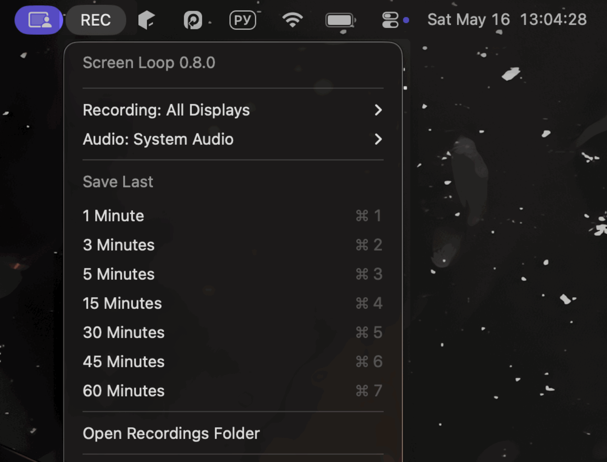

# Screen Loop

Screen Loop is a native macOS menu bar recorder for macOS 14 Sonoma or later. It keeps a rolling 60-minute recorded-media buffer, records the main display or all displays, can optionally include system audio, and saves the last 1, 3, 5, 15, 30, 45, or 60 minutes when something worth keeping just happened.

By default, Screen Loop records the main display with audio `Off` and the `Readable Text` profile. The `Recording` and `Audio` choices persist across app restarts. Advanced items are available by holding `Option`/`Alt` while the menu is open.



## Install

Requires macOS 14 Sonoma or later.

With Homebrew:

```sh
brew install --cask dsxack/tap/screen-loop
```

Current builds are not signed or notarized yet. If macOS blocks the first launch, remove quarantine manually:

```sh
xattr -dr com.apple.quarantine "/Applications/Screen Loop.app"
```

You can also download the release zip from:

```text
https://github.com/dsxack/screen-loop/releases
```

## Build

```sh
make build
make test
make app
```

The app bundle is created at:

```text
.build/app/Screen Loop.app
```

The Makefile uses real output targets where possible. Repeated `make build`, `make app`, and `make package` calls skip work when their source inputs have not changed. `make test` always runs the tests, while SwiftPM keeps the compile step incremental. Use `make clean` to force a full rebuild.

To create the release archive:

```sh
make package
```

The release zip and `.sha256` file are written to `dist/`. `make package` attempts an `arm64` + `x86_64` universal build by default. On CLT-only machines that cannot run SwiftPM universal builds, it falls back to the native architecture. When `REQUIRE_UNIVERSAL_PACKAGE=1` is set, packaging requires a universal archive and can build per-architecture slices with `lipo` if SwiftPM cannot build both architectures directly.

## Run

```sh
open ".build/app/Screen Loop.app"
```

The app runs as a menu bar item without a Dock icon. On first launch, use the menu item to grant Screen Recording permission if macOS has not already granted it. If macOS applies the permission but the system "Quit & Reopen" button does not bring the menu bar item back, the app schedules its own relaunch; `Relaunch Screen Loop` is also available in the app menu while permission is pending.

The app enables `Launch at Login` by default on first launch. You can turn it off from the `Option`/`Alt` menu.

Local builds are ad-hoc signed with a stable designated requirement so macOS privacy permissions survive app rebuilds more reliably. If an older build left Screen Recording permissions stuck, reset the old entry once:

```sh
tccutil reset ScreenCapture com.dsxack.screen-loop
```

Menu actions:

- `Recording`: choose `Main Display`, `All Displays`, or `Off`; the current mode is shown in the menu item title.
- `Audio`: choose `Off` or `System Audio`; the default is `Off`, and the choice persists across app restarts.
- `Save Last` > `1 Minute` or `3/5/15/30/45/60 Minutes`: export a clip from the rolling buffer. In `All Displays` mode, the app creates a timestamped folder with one `.mov` per display, and each display is exported up to its own available history.
- Hold `Option`/`Alt` while the menu is open to show `Available History`, `Buffer Size`, `Profile`, `Launch at Login`, `Open Buffer Folder`, and `Save and Trim Last`.
- `Profile`: choose `Readable Text` (1920 long edge, 15fps, default), `High Quality` (1920 long edge, 30fps), or `Low Power` (1280 long edge, 15fps).

If less history is available than requested, the app saves the available history and names the file or all-display folder with the longest actual exported duration. In `All Displays` mode, the `Option`/`Alt` menu shows one history row per display.

To trim immediately after saving, hold `Option`/`Alt` and choose `1 Minute` or `3/5/15/30/45/60 Minutes` under `Save and Trim Last`. For all-display recordings, the app saves every display first, then opens the `Trim Clip` window with a display picker. `Replace Original` and `Create New` affect only the selected display file.

The recorder listens for macOS sleep/wake and active-session notifications. If recording was enabled before sleep, capture is restarted automatically after wake.

## Privacy

Screen Loop does not upload recordings or telemetry. Buffers and saved clips stay on the local machine.

Saved clips go to:

```text
~/Movies/Screen Loop
```

Temporary ring-buffer segments are stored under:

```text
~/Library/Application Support/Screen Loop/Buffer
```

On launch, the app recovers finalized per-display buffer segments that still fit inside the last 60 minutes of recorded media. Older, invalid, or unfinished temporary segments are removed.

## Release

Release tags must match `CFBundleShortVersionString` in `AppBundle/Info.plist`; for version `0.8.0`, push tag `v0.8.0`.

The `Release` GitHub Action builds and tests the app, packages `ScreenLoop-<version>-macos-universal.zip`, creates or updates GitHub release assets, and updates `Casks/screen-loop.rb` in `dsxack/homebrew-tap`. It expects a `GORELEASER_TOKEN` secret with write access to the tap repository, matching the existing `dsxack/gitfs` release setup.

## License

MIT
